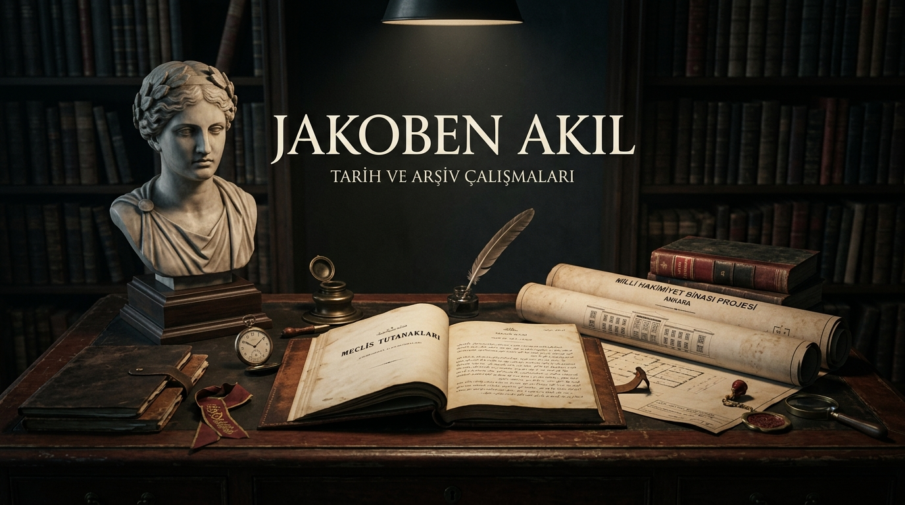
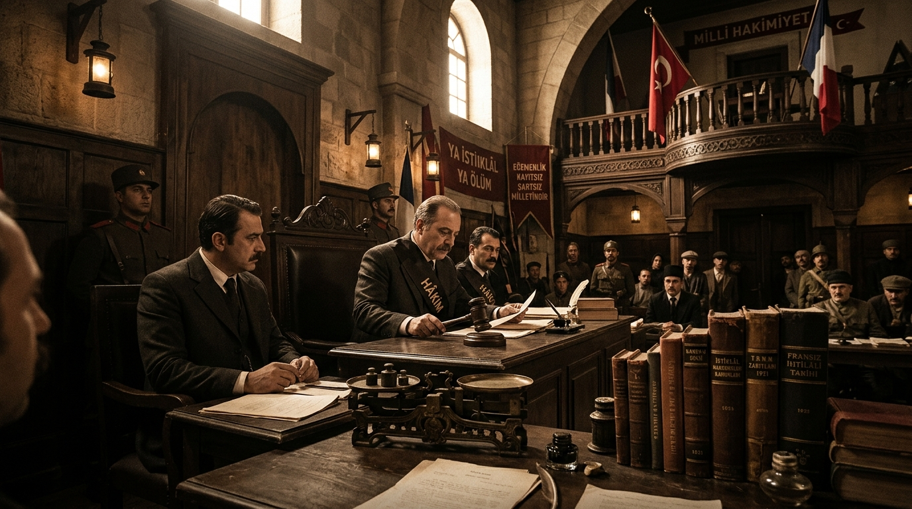
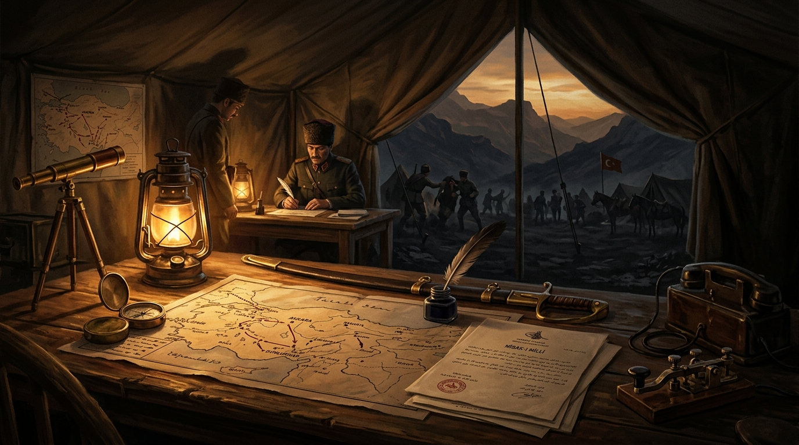
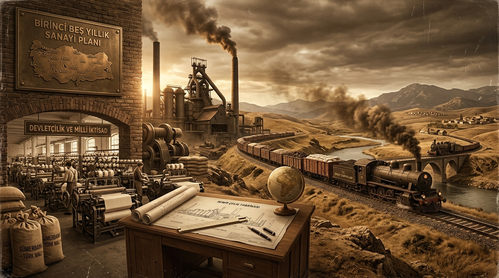
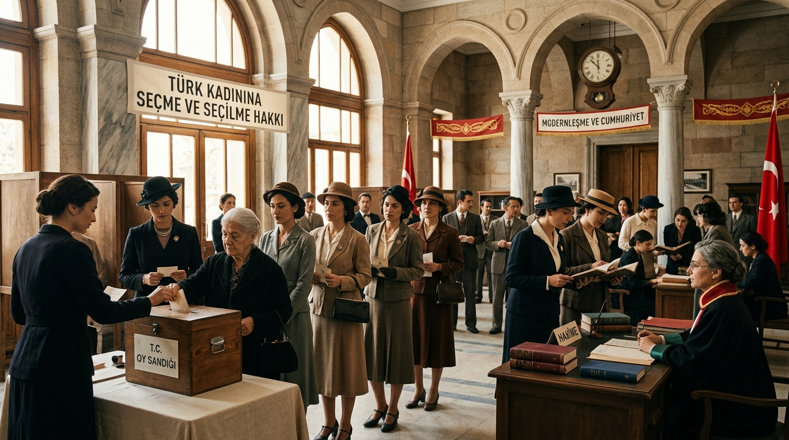
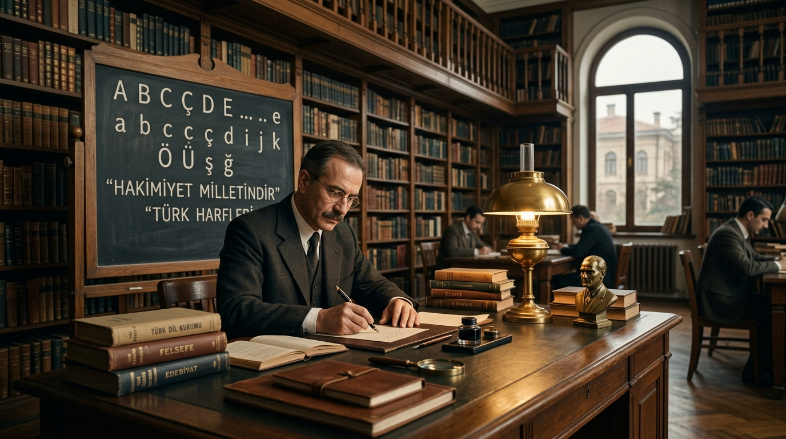
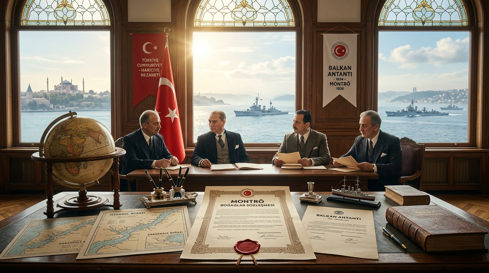
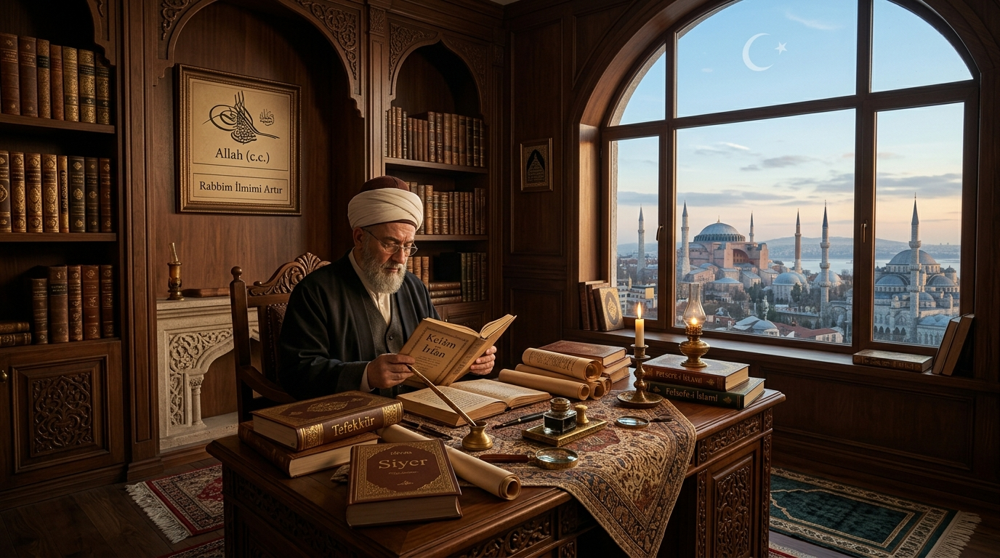
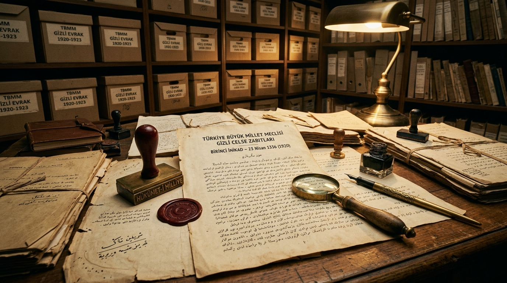

# `jakoben-akil`

<p align="center">
  
</p>

[](https://creativecommons.org/licenses/by/4.0/)
[](#)
[](#)
[](#)

> *"Tarih yazmak, tarih yapmak kadar mühimdir. Yazan yapana sadık kalmazsa değişmeyen hakikat, insanlığı şaşırtacak bir mahiyet alır."*  
> — **Mustafa Kemal Atatürk** (*Türk Tarih Tetkik Cemiyeti Toplantısı, 1931*)

> *"Bir devrim ya bütünüyle yapılır ya da hiç yapılmaz. Yarı yolda duranlar yalnızca kendi mezarlarını kazarlar."*  
> — **Louis Antoine de Saint-Just** (*Fransız Devrimi Konvansiyon Konuşması, 1794*)

> *"Doğu toplumlarında modernleşme tabandan gelen bir talep değil, aydın bürokratik elitin kitleyi kurtarma misyonuyla yürüttüğü pedagojik bir zorlamadır."*  
> — **Prof. Dr. Şerif Mardin** (*Türkiye'de Toplum ve Siyaset*)

---

## 📑 İçindekiler Tablosu

1. [📌 Proje Manifestosu](#-proje-manifestosu)
2. [🏛️ Teorik ve Epistemolojik Çerçeve: Jakoben Akıl Nedir?](#️-teorik-ve-epistemolojik-çerçeve-jakoben-akıl-nedir)
3. [🌐 Karşılaştırmalı Jakoben Devrimler Matrisi (Fransız - Bolşevik - Kemalist)](#-karşılaştırmalı-jakoben-devrimler-matrisi-fransız---bolşevik---kemalist)
4. [📂 Genişletilmiş Dizin Mimarisi](#-genişletilmiş-dizin-mimarisi)
5. [🔬 Yeni Tarihsel Araştırma Alanları ve Tematik Dosyalar](#-yeni-tarihsel-araştırma-alanları-ve-tematik-dosyalar)
   - [5.1. Ulus İnşası, Türkleştirme ve Doğu Raporları (1925-1938)](#51-ulus-inşası-türkleştirme-ve-doğu-raporları-1925-1938)
   - [5.2. Ekonomi-Politik: İzmir İktisat Kongresi'nden Devletçilik ve "Milli Burjuvazi" Teşekkülüne](#52-ekonomi-politik-izmir-iktisat-kongresinden-devletçilik-ve-milli-burjuvazi-teşekkülüne)
   - [5.3. Kadın, Beden ve Aile Siyaseti: "Devlet Feminizmi" mi, Bireysel Özgürleşme mi?](#53-kadın-beden-ve-aile-siyaseti-devlet-feminizmi-mi-bireysel-özgürleşme-mi)
   - [5.4. Radikal Sekülarizm ve Türkçe İbadet Projesi (Ezan, Kuran ve Ayasofya)](#54-radikal-sekülarizm-ve-türkçe-ibadet-projesi-ezan-kuran-ve-ayasofya)
   - [5.5. Üniversite ve Zihniyet İnşası: 1933 Üniversite Reformu ve Müderris Tasfiyeleri](#55-üniversite-ve-zihniyet-inşası-1933-üniversite-reformu-ve-müderris-tasfiyeleri)
   - [5.6. Dış Politika ve Jeopolitik Realizm: "Yurtta Sulh, Cihanda Sulh" Dekonstrüksiyonu](#56-dış-politika-ve-jeopolitik-realizm-yurtta-sulh-cihanda-sulh-dekonstrüksiyonu)
6. [⚖️ Çok Boyutlu Tarihsel Perspektifler ve Zengin Alıntılar Arşivi](#️-çok-boyutlu-tarihsel-perspektifler-ve-zengin-alıntılar-arşivi)
   - [1. Kurucu ve Radikal Aydınlanmacı Çevre](#1-kurucu-ve-radikal-aydınlanmacı-çevre)
   - [2. Silah Arkadaşları ve Meclis İçi Muhalefet](#2-silah-arkadaşları-ve-meclis-içi-muhalefet)
   - [3. İslami, Gelenekçi ve Muhafazakâr Düşünürler](#3-islami-gelenekçi-ve-muhafazakâr-düşünürler)
   - [4. Sol, Marksist ve Sosyalist / Eleştirel Yaklaşımlar](#4-sol-marksist-ve-sosyalist--eleştirel-yaklaşımlar)
   - [5. Yabancı Biyograflar ve Batılı Akademisyenler](#5-yabancı-biyograflar-ve-batılı-akademisyenler)
7. [📊 Genişletilmiş 10 Boyutlu Karşılaştırma Matrisi](#-genişletilmiş-10-boyutlu-karşılaştırma-matrisi)
8. [⏳ Tarihsel Kırılma Kronolojisi (1919 – 1938)](#-tarihsel-kırılma-kronolojisi-1919--1938)
9. [📚 Kapsamlı Akademik Bibliyografya](#-kapsamlı-akademik-bibliyografya)
10. [🛠️ Metodoloji ve Katkı Kuralları](#️-metodoloji-ve-katkı-kuralları)
11. [📄 Lisans](#-lisans)

---

## 📌 Proje Manifestosu

**`jakoben-akil`**, Türkiye Cumhuriyeti'nin kuruluş sürecini, Mustafa Kemal Atatürk'ün askeri ve siyasal stratejilerini, devrimci otorite kullanımını ve modernleşme tercihlerini; **apolojetik övgücülükten**, **önyargılı toptancı reddiyeden** ve **sığ kutuplaşmalardan** arındırarak tahlil eden bağımsız, açık kaynaklı bir karşılaştırmalı tarih ve siyaset felsefesi arşividir.

Bu proje ne resmi ideolojinin kutsayıcı pedagojisini ne de muhafazakâr reaksiyonerliğin anakronik yargılarını temsil eder. Gayemiz; Fransız İhtilali'nden İttihat ve Terakki'ye, oradan erken Cumhuriyet bürokrasisine evrilen **"Jakoben Akıl"** paradigmasını (kamu selameti, tepeden inmeci aydınlanma, radikal kopuş, elitist pedagoji ve modern ulus-devlet inşası) bizzat tarafların kendi kaleminden çıkan metinlerle, meclis zabıtlarıyla ve uluslararası akademik tahlillerle masaya yatırmaktır.

Bu arşivde bir sentez dayatılmaz; **tarihin bizzat çatışan aktörleri doğrudan konuşturulur**.

---

## 🏛️ Teorik ve Epistemolojik Çerçeve: Jakoben Akıl Nedir?

Cumhuriyet modernleşmesini kavramak için Jakobenizmin Osmanlı-Türk modernleşmesindeki köklerini açığa çıkarmak elzemdir:

```text
               ┌────────────────────────────────────────────────────────┐
               │         AYDINLANMA FELSEFESİ & RADİKALİZM              │
               │  (Rousseau: Genel İrade / Robespierre: Kamu Selameti)  │
               └──────────────────────────┬─────────────────────────────┘
                                          │
                                          ▼
               ┌────────────────────────────────────────────────────────┐
               │           POZİTİVİZM & MATERYALİST PEDAGOJİ            │
               │    (Auguste Comte / Dr. Abdullah Cevdet / Beşir Fuad)  │
               └──────────────────────────┬─────────────────────────────┘
                                          │
                                          ▼
               ┌────────────────────────────────────────────────────────┐
               │           İTTİHAT VE TERAKKİ GELENEĞİ (1908)           │
               │  (Ziya Gökalp Solidarizmi / Askeri Bürokrasi İradesi)   │
               └──────────────────────────┬─────────────────────────────┘
                                          │
                                          ▼
               ┌────────────────────────────────────────────────────────┐
               │           KEMALİST JAKOBENİZM (1923 - 1938)            │
               │   "Halk İçin, Halka Rağmen" Radikal Ulus-Devlet İnşası │
               │   • İstiklal Mahkemeleri  • Harf Devrimi • Laiklik      │
               └────────────────────────────────────────────────────────┘
```

1. **Kamu Selameti (Salut Public) ve İhtilal Hukuku:** Jakoben gelenek, olağanüstü dönemlerde milletin kurtuluşunu ve inkılabın bekasını yürürlükteki pozitif hukukun üstünde görür. Mahmut Esat Bozkurt'un tabiriyle *"İhtilal kanunları mevcut kanunların üstündedir."* İhtilal meşruiyetini kendi başarısından alır.
2. **Genel İrade (Volonté Générale) vs. Çoğunluk İradesi:** Jean-Jacques Rousseau'nun kuramında olduğu gibi, halkın güncel talepleri (çoğunluk tercihi) her zaman onun "hakiki ve rasyonel çıkarını" (genel iradeyi) yansıtmayabilir. Skolastik geleneklerin baskısı altındaki halk henüz kendi hakiki menfaatini bilebilecek rüştte kabul edilmez. Bu sebeple aydın öncü kadro, halkı kendi cehaletinden ve geleneksel prangalarından "kurtarma" misyonunu üstlenir.
3. **Kültürel Mühendislik ve Radikal Epistemolojik Kopuş:** Anglo-Sakson evrimci modernleşmesinin (tedricilik ve uzlaşma) aksine; harf devrimi, kılık kıyafet kanunu, tekke-zaviyelerin kapatılması ve Medeni Kanun gibi adımlarla geçmişle olan sembolik, kurumsal, lisani ve hukuki bağlar tek bir hamlede koparılır.
4. **Devletçi-Dayanışmacı Toplum Tasarımı (Solidarizm):** Ziya Gökalp'in *"Fert yok, cemiyet var; hak yok, vazife var"* şiarıyla şekillenen Émile Durkheim kaynaklı solidarizm; Marksist sınıf mücadelesini ve liberal bireyciliği aynı anda reddeder. Toplum, birbirine muhtaç meslek zümrelerinden müteşekkil, imtiyazsız, sınıfsız, kaynaşmış bir kitle olarak kurgulanır.

---

## 🌐 Karşılaştırmalı Jakoben Devrimler Matrisi (Fransız - Bolşevik - Kemalist)

<p align="center">
  
</p>

Modern tarihteki üç büyük radikal dönüşüm modelinin karşılaştırmalı analizi:

| Karşılaştırma Ekseni | Fransız Devrimi (1789-1794) | Bolşevik Devrimi (1917-1924) | Kemalist Devrim (1919-1938) |
| :--- | :--- | :--- | :--- |
| **Öncü Kadro ve Aktörler** | Avukatlar, aydınlar, radikal burjuvazi (Jakoben Kulübü, Robespierre, Saint-Just) | Profesyonel ihtilalciler, entelektüeller, işçi-asker sovyetleri (Lenin, Troçki) | Osmanlı ordu zabitleri, aydın bürokratlar (Mustafa Kemal, İsmet İnönü) |
| **İdeolojik Referans** | Aydınlanma Felsefesi, Rousseau, Doğal Haklar, Ulus Egemenliği | Marksizm-Leninizm, Tarihsel Materyalizm, Proletarya Diktatörlüğü | Pozitivizm (Auguste Comte), Solidarizm (Gökalp), Türk Milliyetçiliği |
| **Toplumsal Taban / Sınıf** | Üçüncü Sınıf (Tiers État), Sans-culottes (baldırcıplaklar) | Fabrika proletaryası ve yoksul köylülük (Sovyetler) | Bürokrasi, askerler, yerel eşraf ittifakı (Köylü sınıfı nesnedir) |
| **Olağanüstü Yargı Organı** | *Tribunal révolutionnaire* (Devrim Mahkemesi) & Giyotin | Çeka, Askeri Devrimci Komiteler & Kızıl Terör | İstiklal Mahkemeleri (Ankara, Şark) |
| **Din Politikası** | Hristiyanlıktan Arındırma (*Déchristianisation*), Akıl Kültü | Bilimsel Ateizm, Kiliselerin Mülksüzleştirilmesi, Din Karşıtı Propaganda | Mücadeleci Laiklik (*Laïcité de combat*), Diyanet eliyle devlet denetimi |
| **Kültürel Kopuş Yöntemi** | Jakoben Takvimi, Metrik Sistem, Kılık kıyafet devrimi | Eski takvimin terki, Proletkult hareketi, Dinamik alfabe reformları | Harf İnkılabı, Türkçeleştirme, Şapka Kanunu, Hafta Tatili, Metrik Sistem |
| **Mülkiyet Anlayışı** | Özel mülkiyeti kutsayan burjuva anayasası | Özel mülkiyetin lağvı, üretim araçlarının kamulaştırılması | Özel mülkiyet güvencesi + Zorunlu Devletçilik (Milli Burjuvazi inşası) |

---

## 📂 Genişletilmiş Dizin Mimarisi

Arşiv, tematik dosyalar, birincil meclis zabıtları, gizli raporlar ve doğrudan tarihsel alıntılardan oluşan hiyerarşik bir yapıda düzenlenmiştir:

```text
jakoben-akil/
├── 01-harp-ve-askeri-doktrin/
│   ├── canakkale-ve-trablusgarp-emir-komuta.md
│   ├── sakarya-baskomutanlik-kanunu-ve-tartismalar.md
│   └── buyuk-taarruz-stratejisi-ve-cephe-tanikliklari.md
├── 02-mesruiyet-ve-iktidar-mucadelesi/
│   ├── birinci-meclis-ikinci-grup-muhalefeti.md
│   ├── saltanat-ve-hilafetin-ilgasinda-metot.md
│   ├── terakkiperver-cumhuriyet-firkasi-ve-kapatilmasi.md
│   ├── serbest-cumhuriyet-firkasi-deneyi.md
│   ├── 1934-iskan-kanunu-ve-sark-raporlari.md
│   └── kadinlar-halk-firkasi-ve-devlet-feminizmi.md
├── 03-hukuk-olagandisi-rejim-ve-tasfiyeler/
│   ├── istiklal-mahkemeleri-kararlari-ve-uygulamalar.md
│   ├── takrir-i-sukun-kanunu-ve-basin-rejimi.md
│   └── 1926-izmir-suikasti-ve-ittihatci-kadro-tasfiyesi.md
├── 04-jakoben-aydinlanma-ve-kulturel-kirilma/
│   ├── harf-ve-dil-devrimi-kulturel-hafiza-tartismasi.md
│   ├── kilik-kiyafet-ve-sapka-kanunu-tepkileri.md
│   ├── laiklik-ve-diyanet-isleri-baskanligi-pragmatizmi.md
│   ├── medeni-kanun-ve-kadin-haklari.md
│   ├── turkce-ezan-ve-ibadet-politikasi.md
│   └── 1933-universite-reformu-ve-aydin-tasfiyesi.md
├── 05-perspektifler-ve-tanikliklar/
│   ├── README.md                      # Beş düşünce ekolünün epistemolojik haritası
│   ├── kurucu-ve-resmi-kadro/        # Falih Rıfkı, Mahmut Esat, Afet İnan, Celal Bayar, İsmet İnönü
│   ├── meclis-ve-silah-arkadaslari/  # Karabekir, Rauf Orbay, Ali Fuat, Halide Edip, Hüseyin Avni
│   ├── muhafazakar-ve-islamci/       # Mehmet Akif, Necip Fazıl, Said Nursi, Meriç, Topçu, Başgil, Tanpınar, Mardin, Elmalılı, Eşref Edip, Mustafa Sabri
│   ├── sol-ve-sosyalist-tahliller/   # Kıvılcımlı, Küçükömer, Şevket Süreyya, Boratav, Avcıoğlu, Berkes
│   └── yabanci-biyografi-ve-rapor/   # Mango, Kinross, Armstrong, Lewis, Toynbee, Zürcher
└── 06-birincil-belgeler-arsivi/
    ├── tbmm-gizli-celse-zabitlari/   # Saltanat, hilafet, başkomutanlık, takrir-i sükûn tutanakları
    └── donemsel-kararnameler-ve-yazismalar/ # Tekâlif-i Milliye, İzmir suikastı hükümleri, kararnameler
```

### 🔗 Doğrudan Dosya Gezgini

| Kategori / Dizin | Dosyalar ve Araştırma Metinleri |
| :--- | :--- |
| **01 - Harp ve Askeri Doktrin** | • [Çanakkale ve Trablusgarp Savaşları](01-harp-ve-askeri-doktrin/canakkale-ve-trablusgarp-emir-komuta.md)<br>• [Sakarya ve Başkomutanlık Kanunu](01-harp-ve-askeri-doktrin/sakarya-baskomutanlik-kanunu-ve-tartismalar.md)<br>• [Büyük Taarruz Stratejisi ve Gizlilik](01-harp-ve-askeri-doktrin/buyuk-taarruz-stratejisi-ve-cephe-tanikliklari.md) |
| **02 - Meşruiyet ve İktidar Mücadelesi** | • [Birinci Meclis İkinci Grup Muhalefeti](02-mesruiyet-ve-iktidar-mucadelesi/birinci-meclis-ikinci-grup-muhalefeti.md)<br>• [Saltanat ve Hilafetin İlgasında Metot](02-mesruiyet-ve-iktidar-mucadelesi/saltanat-ve-hilafetin-ilgasinda-metot.md)<br>• [Terakkiperver Fırka ve Kapatılması](02-mesruiyet-ve-iktidar-mucadelesi/terakkiperver-cumhuriyet-firkasi-ve-kapatilmasi.md)<br>• [Serbest Cumhuriyet Fırkası Deneyi](02-mesruiyet-ve-iktidar-mucadelesi/serbest-cumhuriyet-firkasi-deneyi.md)<br>• [1934 İskân Kanunu ve Şark Raporları](02-mesruiyet-ve-iktidar-mucadelesi/1934-iskan-kanunu-ve-sark-raporlari.md)<br>• [Kadınlar Halk Fırkası ve Devlet Feminizmi](02-mesruiyet-ve-iktidar-mucadelesi/kadinlar-halk-firkasi-ve-devlet-feminizmi.md) |
| **03 - Hukuk, Olağandışı Rejim ve Tasfiyeler** | • [İstiklal Mahkemeleri Kararları ve Uygulamalar](03-hukuk-olagandisi-rejim-ve-tasfiyeler/istiklal-mahkemeleri-kararlari-ve-uygulamalar.md)<br>• [Takrir-i Sükûn Kanunu ve Basın Rejimi](03-hukuk-olagandisi-rejim-ve-tasfiyeler/takrir-i-sukun-kanunu-ve-basin-rejimi.md)<br>• [1926 İzmir Suikastı ve İttihatçı Kadro Tasfiyesi](03-hukuk-olagandisi-rejim-ve-tasfiyeler/1926-izmir-suikasti-ve-ittihatci-kadro-tasfiyesi.md) |
| **04 - Jakoben Aydınlanma ve Kültürel Kırılma** | • [Harf ve Dil Devrimi Tartışması](04-jakoben-aydinlanma-ve-kulturel-kirilma/harf-ve-dil-devrimi-kulturel-hafiza-tartismasi.md)<br>• [Kılık Kıyafet ve Şapka Kanunu Tepkileri](04-jakoben-aydinlanma-ve-kulturel-kirilma/kilik-kiyafet-ve-sapka-kanunu-tepkileri.md)<br>• [Laiklik ve Diyanet İşleri Başkanlığı](04-jakoben-aydinlanma-ve-kulturel-kirilma/laiklik-ve-diyanet-isleri-baskanligi-pragmatizmi.md)<br>• [Türk Medeni Kanunu ve Kadın Hakları](04-jakoben-aydinlanma-ve-kulturel-kirilma/medeni-kanun-ve-kadin-haklari.md)<br>• [Türkçe Ezan ve İbadet Politikası](04-jakoben-aydinlanma-ve-kulturel-kirilma/turkce-ezan-ve-ibadet-politikasi.md)<br>• [1933 Üniversite Reformu ve Müderris Tasfiyesi](04-jakoben-aydinlanma-ve-kulturel-kirilma/1933-universite-reformu-ve-aydin-tasfiyesi.md) |
| **05 - Perspektifler ve Tanıklıklar** | • [Dizin Kılavuzu](05-perspektifler-ve-tanikliklar/README.md)<br>• **Kurucu Kadro:** [Falih Rıfkı](05-perspektifler-ve-tanikliklar/kurucu-ve-resmi-kadro/falih-rifki-atay.md), [Mahmut Esat](05-perspektifler-ve-tanikliklar/kurucu-ve-resmi-kadro/mahmut-esat-bozkurt.md), [İsmet İnönü](05-perspektifler-ve-tanikliklar/kurucu-ve-resmi-kadro/ismet-inonu.md), [Celal Bayar](05-perspektifler-ve-tanikliklar/kurucu-ve-resmi-kadro/celal-bayar.md), [Afet İnan](05-perspektifler-ve-tanikliklar/kurucu-ve-resmi-kadro/afet-inan.md)<br>• **Silah Arkadaşları:** [Karabekir](05-perspektifler-ve-tanikliklar/meclis-ve-silah-arkadaslari/kazim-karabekir.md), [Rauf Orbay](05-perspektifler-ve-tanikliklar/meclis-ve-silah-arkadaslari/rauf-orbay.md), [Ali Fuat Cebesoy](05-perspektifler-ve-tanikliklar/meclis-ve-silah-arkadaslari/ali-fuat-cebesoy.md), [Halide Edip](05-perspektifler-ve-tanikliklar/meclis-ve-silah-arkadaslari/halide-edip-adivar.md), [Hüseyin Avni Ulaş](05-perspektifler-ve-tanikliklar/meclis-ve-silah-arkadaslari/huseyin-avni-ulas.md)<br>• **Muhafazakâr & İslamcı:** [Mehmet Âkif](05-perspektifler-ve-tanikliklar/muhafazakar-ve-islamci/mehmet-akif-ersoy.md), [Necip Fazıl](05-perspektifler-ve-tanikliklar/muhafazakar-ve-islamci/necip-fazil-kisakurek.md), [Said Nursi](05-perspektifler-ve-tanikliklar/muhafazakar-ve-islamci/said-nursi.md), [Cemil Meriç](05-perspektifler-ve-tanikliklar/muhafazakar-ve-islamci/cemil-meric.md), [Nurettin Topçu](05-perspektifler-ve-tanikliklar/muhafazakar-ve-islamci/nurettin-topcu.md), [Ali Fuad Başgil](05-perspektifler-ve-tanikliklar/muhafazakar-ve-islamci/ali-fuad-basgil.md), [Ahmet Hamdi Tanpınar](05-perspektifler-ve-tanikliklar/muhafazakar-ve-islamci/ahmet-hamdi-tanpinar.md), [Şerif Mardin](05-perspektifler-ve-tanikliklar/muhafazakar-ve-islamci/serif-mardin.md), [Elmalılı Hamdi](05-perspektifler-ve-tanikliklar/muhafazakar-ve-islamci/elmalili-hamdi-yazir.md), [Eşref Edip](05-perspektifler-ve-tanikliklar/muhafazakar-ve-islamci/esref-edip-fergan.md), [Mustafa Sabri](05-perspektifler-ve-tanikliklar/muhafazakar-ve-islamci/mustafa-sabri-efendi.md)<br>• **Sol & Sosyalist:** [Kıvılcımlı](05-perspektifler-ve-tanikliklar/sol-ve-sosyalist-tahliller/hikmet-kivilcimli.md), [Küçükömer](05-perspektifler-ve-tanikliklar/sol-ve-sosyalist-tahliller/idris-kucukomer.md), [Aydemir](05-perspektifler-ve-tanikliklar/sol-ve-sosyalist-tahliller/sevket-sureyya-aydemir.md), [Berkes](05-perspektifler-ve-tanikliklar/sol-ve-sosyalist-tahliller/niyazi-berkes.md), [Boratav](05-perspektifler-ve-tanikliklar/sol-ve-sosyalist-tahliller/korkut-boratav.md), [Avcıoğlu](05-perspektifler-ve-tanikliklar/sol-ve-sosyalist-tahliller/dogan-avcioglu.md)<br>• **Yabancı Tarihçiler:** [Mango](05-perspektifler-ve-tanikliklar/yabanci-biyografi-ve-rapor/andrew-mango.md), [Kinross](05-perspektifler-ve-tanikliklar/yabanci-biyografi-ve-rapor/lord-kinross.md), [Armstrong](05-perspektifler-ve-tanikliklar/yabanci-biyografi-ve-rapor/h-c-armstrong.md), [Lewis](05-perspektifler-ve-tanikliklar/yabanci-biyografi-ve-rapor/bernard-lewis.md), [Zürcher](05-perspektifler-ve-tanikliklar/yabanci-biyografi-ve-rapor/erik-jan-zurcher.md), [Toynbee](05-perspektifler-ve-tanikliklar/yabanci-biyografi-ve-rapor/arnold-toynbee.md) |
| **06 - Birincil Belgeler Arşivi** | • [Saltanat ve Hilafet Gizli Celseleri](06-birincil-belgeler-arsivi/tbmm-gizli-celse-zabitlari/saltanat-ve-hilafet-gizli-celseler.md)<br>• [Başkomutanlık ve Sakarya Gizli Celseleri](06-birincil-belgeler-arsivi/tbmm-gizli-celse-zabitlari/baskomutanlik-ve-sakarya-gizli-celseler.md)<br>• [Takrir-i Sükûn ve İstiklal Mahkemeleri Celseleri](06-birincil-belgeler-arsivi/tbmm-gizli-celse-zabitlari/takrir-i-sukun-ve-istiklal-mahkemeleri-celseleri.md)<br>• [Tekâlif-i Milliye ve Olağanüstü Kararnameler](06-birincil-belgeler-arsivi/donemsel-kararnameler-ve-yazismalar/tekalif-i-milliye-ve-olagandisi-kararnameler.md)<br>• [İzmir Suikastı ve İdam Hükümleri](06-birincil-belgeler-arsivi/donemsel-kararnameler-ve-yazismalar/izmir-suikasti-ve-mahkeme-zabitan-ozetleri.md) |

---

## 🔬 Yeni Tarihsel Araştırma Alanları ve Tematik Dosyalar

<p align="center">
  
</p>

Bu bölümde, Cumhuriyet dönemi Jakoben aklının yakın dönem akademik çalışmalara konu olan altı temel ameliyat sahası derinlemesine incelenmektedir.

---

### 5.1. Ulus İnşası, Türkleştirme ve Doğu Raporları (1925-1938)

Erken Cumhuriyet'in en kritik iç güvenlik ve modernleşme problemi, çok-etnili imparatorluk bakiyesinden yekpare bir Türk ulusu yaratmaktı. Bu süreç Şeyh Said (1925), Ağrı (1926-1930) ve Dersim (1937-1938) hadiseleriyle güvenlikçi ve demografik bir mühendisliğe evrildi.

* **1934 İskân Kanunu (Kanun No: 2510):** Türkiye topraklarını üç iskân bölgesine ayırdı:
  1. *1 Nolu Mıntıkalar:* Türk kültürlü nüfusun yoğunlaştırılacağı yerler.
  2. *2 Nolu Mıntıkalar:* Türk kültürüne temsili (asimilasyonu) istenen nüfusun nakil ve iskân edileceği yerler.
  3. *3 Nolu Mıntıkalar:* Yerleşime ve iskâna tamamen yasaklanan sahalar.
* **İsmet İnönü'nün Gizli Şark Seyahati Raporu (1935):**
  > *"Erzincan Kürt merkezi olursa Kürdistanın kurulmasından korkulur... Van gölü havzasını süratle Türkleştirmek zorundayız. Kürtleri Türk ocakları ve maarif yoluyla eritmek devletin hayat memat meselesidir."* (*İsmet İnönü'nün Doğu Raporu*, Yayına Hazırlayan: Saygı Öztürk)
* **Celal Bayar'ın İktisadi Entegrasyon Raporu (1936):**
  İnönü'nün katı askeri-asimilasyonist yaklaşımına karşılık İktisat Vekili Celal Bayar; Doğu'ya yol, fabrika, ziraat kredisi ve istihdam götürülerek feodal aşiret bağlarının çözülebileceğini savundu.
* **Mahmut Esat Bozkurt'un Radikal Çıkışı (1930):**
  > *"Biz Türkiye denen dünyanın en hür memleketinde yaşıyoruz. Mebusunuz o kanaattedir ki, bu memleketin efendisi Türktür. Öz Türkçe olmayanların Türk vatanında bir tek hakları vardır; o da hizmetçi olmak hakkı, köle olmak hakkıdır!"* (*Ödemiş Nutku*, 19 Eylül 1930)

---

### 5.2. Ekonomi-Politik: İzmir İktisat Kongresi'nden Devletçilik ve "Milli Burjuvazi" Teşekkülüne

<p align="center">
  
</p>

Kemalist modernleşmenin iktisat vizyonu, bağımsız bir milli ekonomi inşa etme hedefiyle şekillendi:

* **1923 İzmir İktisat Kongresi ve Liberal Dönem (1923-1929):** Kongre, yabancı sermayeye açık, özel mülkiyeti tanıyan fakat gayrimüslim tekelini kırmayı amaçlayan "Misak-ı İktisadi"yi kabul etti. Aşar vergisinin kaldırılması (1925) köylüyü rahatlattı fakat tarımda köklü bir toprak reformu yapılmasını engelledi.
* **1929 Büyük Buhranı ve Devletçilik (Etatism):** Serbest piyasanın çöküşüyle birlikte Türkiye, Sovyet tipi planlamadan esinlenen **Birinci Beş Yıllık Sanayi Planı**'nı (1934) devreye soktu. Sümerbank ve Etibank kurularak dokuma, şeker, demir-çelik sanayisi devlet eliyle inşa edildi.
* **Bürokratik Klik Çatışması:**
  * *İsmet İnönü Kanadı:* Katı devletçilik, döviz ve ithalat kontrolleri, bürokratik planlama.
  * *İş Bankası Çevresi (Celal Bayar):* Devletin sermaye birikimi sağlayıp milli özel teşebbüse devretmesini savunan pragmatik devletçilik.
* **Kadro Dergisi Teorisi (Şevket Süreyya Aydemir, Yakup Kadri):**
  > *"Türkiye ne Batı tipi vahşi kapitalizme ne de sınıf kavgası güden Marksizme teslim olabilir. Bizim yolumuz; aydın öncü kadronun yönettiği, sınıfsız, imtiyazsız ve planlı bir milli kurtuluş iktisadıdır."* (*Kadro*, Sayı 1, 1932)
* **Akademik Değerlendirme (Prof. Dr. Korkut Boratav):**
  > *"Erken Cumhuriyet devletçiliği anti-kapitalist değil, kapitalist gelişmeyi hızlandırmaya dönük bir devlet kapitalizmidir. Devlet eliyle sermaye biriktirilmiş, palazlanan milli burjuvaziye aktarılmıştır."* (*Türkiye İktisat Tarihi*)

---

### 5.3. Kadın, Beden ve Aile Siyaseti: "Devlet Feminizmi" mi, Bireysel Özgürleşme mi?

<p align="center">
  
</p>

Kemalist inkılabın en çok övülen boyutu kadın haklarıdır; ancak feminist ve sosyolojik tarihçilik bu süreci farklı bir analize tabi tutar:

* **1926 Medeni Kanun Devrimi:** Çok eşlilik yasaklandı, boşanma ve miras hakkı eşitlendi, medeni nikâh zorunlu kılındı.
* **Siyasi Haklar Kronolojisi:** 1930 Belediye Seçimleri, 1933 Muhtarlık Seçimleri, 5 Aralık 1934 TBMM Seçme ve Seçilme Hakkı (Fransa, İtalya ve İsviçre'den yıllar önce).
* **Nezihe Muhiddin ve Kadınlar Halk Fırkası Olayı (1923):**
  Cumhuriyet Halk Fırkası'ndan önce Nezihe Muhiddin tarafından kurulan ilk kadın partisi, *"kadınların henüz siyasi hakları olmadığı"* gerekçesiyle valilikçe tescil edilmedi. Parti, **Türk Kadınlar Birliği** adıyla derneğe dönüştürüldü; 1935'te kadınlara siyasi haklar verildikten hemen sonra *"artık gayeniz gerçekleşti"* denilerek bizzat rejim tarafından feshettirildi.
* **Devlet Feminizmi ve Patriyarkal Pazarlık:**
  * **Prof. Dr. Nilüfer Göle (*Modern Mahrem*):** Cumhuriyet modernleşmesi kadını kamusal alana çıkardı; fakat onu birey olarak değil, modernliğin vitrini ve "milletin iffetli annesi" olarak kurguladı. Kadının bedeni seküler devlet ile geleneksel İslam arasındaki sembolik harp sahasına dönüştü.
  * **Deniz Kandiyoti (*Cariyeler, Bacılar, Yurttaşlar*):** Kadın hakları kadınların tabandan gelen kitlesel mücadelesiyle değil, Kemalist erkek bürokrasinin Batı'ya rüştünü ispat etme projesi (devlet feminizmi) olarak yukarıdan lütfedildi.

---

### 5.4. Radikal Sekülarizm ve Türkçe İbadet Projesi (Ezan, Kuran ve Ayasofya)

Kemalist Jakobenizmin dini dönüştürme projesi, yalnızca kurumları lağvetmekle yetinmedi; ibadetin diline ve mekânına da müdahale etti:

* **Türkçe Ezan Uygulaması (1932-1950):** 
  Ocak 1932'de Yerebatan Camii'nde Hafız Yaşar Okur tarafından ilk Türkçe Kur'an okundu. 30 Ocak 1932'de Fatih Camii minaresinden ilk Türkçe ezan okundu. Diyanet İşleri Reisliği 18 Temmuz 1932'de tamim yayımlayarak Arapça ezan ve kameti yasakladı. 1941'de Türk Ceza Kanunu'nun 526. maddesine eklenen fıkrayla Arapça ezan okuyanlara hapis ve para cezası getirildi.
* **1932 Bursa Hadisesi ve Mustafa Kemal'in Reaksiyonu:**
  Bursa'da ezanın Türkçe okunmasına karşı çıkan küçük bir grubun valiliğe yürümesi üzerine Gazi bizzat Bursa'ya gitti ve tarihi açıklamasını yaptı:
  > *"Hadise katiyen din meselesi değildir; dil meselesidir. Katiyen bilmelidir ki, Türk milletinin milli dili ve milli benliği bütün hayatında hakim ve esas kalacaktır."* (6 Şubat 1933)
* **Ayasofya'nın Müzeye Dönüştürülmesi (24 Kasım 1934):**
  Fatih Sultan Mehmed'in kılıç hakkı ve İstanbul'un fethinin sembolü olan Ayasofya Camii, 24 Kasım 1934 tarihli Bakanlar Kurulu kararnamesiyle müzeye tahsis edildi. Bu adım, Cumhuriyet'in Bizans mirasını kucaklayarak Batı medeniyetine sunduğu en radikal seküler iyi niyet jesti olarak yorumlandı.
* **Said Nursi ve Mistik Sivil Direniş:**
  Şeyh Said ve Menemen hadiseleri gibi silahlı reaksiyonların aksine; Said Nursi, telif ettiği *Risale-i Nur* risalelerini el yazısıyla Anadolu köylerine yayarak rejimin pozitivist ve materyalist eğitimine karşı gizli, sivil ve entelektüel bir inanç müdafaası yürüttü. Barla, Kastamonu, Emirdağ sürgünleri ve Eskişehir, Denizli, Afyon mahkemelerinde yargılandı.

---

### 5.5. Üniversite ve Zihniyet İnşası: 1933 Üniversite Reformu ve Müderris Tasfiyeleri

<p align="center">
  
</p>

Aydınlanmanın zihniyet altyapısını kurmak için geleneksel yükseköğretim kurumu tasfiye edildi:

* **Darülfünun'un Sonu ve Prof. Albert Malche Raporu:**
  Osmanlı'dan kalan Darülfünun, inkılapları desteklememekle, Türk Tarih ve Dil Tezlerine ilgisiz kalmakla suçlandı. İsviçreli pedagog Prof. Albert Malche davet edilerek bir rapor hazırlatıldı.
* **1933 Reformu ve Büyük Tasfiye:**
  31 Temmuz 1933'te Darülfünun ilga edildi, 1 Ağustos'ta **İstanbul Üniversitesi** kuruldu. Mevcut 240 müderris ve muallimden 157'si (aralarında İsmail Hakkı Baltacıoğlu, Babanzade Ahmed Naim, Ali Kemalizade Zeki Velidi Togan, Şekip Tunç gibi devrin en yetkin ilim adamları) üniversiteden bir gecede kovuldu.
* **Maarif Vekili Dr. Reşit Galip'in Tasfiye Gerekçesi:**
  > *"Millet büyük inkılaplar yaparken Darülfünun tarafsız bir seyirci gibi kaldı. İnkılapları benimsemeyen, onun heyecanını duymayan bir müesseseye yeni Türkiye'de tahammül edilemez!"*
* **Nazi Almanyası'ndan Kaçan Bilim İnsanları:**
  Tasfiyeyle boşalan kadrolara, Hitler rejiminden kaçan Yahudi ve muhalif Alman bilim insanları (Fritz Neumark, Ernst Reuter, Philipp Schwartz, Leo Spitzer vb.) yerleştirildi. Bu hamle bir yandan Türkiye'de modern akademik standartların kurulmasını sağlarken, diğer yandan yerli düşünce sürekliliğini kesintiye uğrattı.
* **Türk Ocakları'nın Feshi ve Halkevleri (1932):**
  1912'den beri Türk milliyetçiliğinin ocağı olan özerk Türk Ocakları, 1931 kurultayında kapatılarak gayrimenkulleriyle birlikte CHF'ye devredildi ve 1932'de partinin doğrudan halk eğitimi şubesi olarak **Halkevleri** kuruldu.

---

### 5.6. Dış Politika ve Jeopolitik Realizm: "Yurtta Sulh, Cihanda Sulh" Dekonstrüksiyonu

<p align="center">
  
</p>

Mustafa Kemal Atatürk'ün dış politika stratejisi romantik bir pasifizm değil, içerideki radikal dönüşümü dış tehditlerden korumayı hedefleyen soğukkanlı bir realizmdir:

* **Revizyonizmden Kaçınma:** Birinci Dünya Savaşı mağlubu ülkelerin (Almanya, İtalya, Macaristan) aksine Türkiye, Lozan ile çizilen sınırları bir kader değil başarı saydı; Misak-ı Milli'yi tamamladıktan sonra yayılmacı maceracılıktan kaçındı.
* **İttifaklar Mimarisi:** İtalya'nın Akdeniz'deki saldırganlığına karşı **Balkan Antantı** (1934), doğu sınırlarının güvenliği için **Sadabat Paktı** (1937) kuruldu.
* **Montrö Boğazlar Sözleşmesi (1936):** İkinci Dünya Savaşı'nın ayak sesleri duyulurken uluslararası konjonktür dehasıyla Boğazlar Komisyonu lağvedildi ve Boğazlar Türk ordusunun tam egemenliğine bırakıldı.
* **Hatay Hamlesi (1938):** Milletler Cemiyeti mekanizmasını ustalıkla kullanan, gerektiğinde sınıra bizzat trenle giderek askeri güç gösterisi yapan Atatürk; Fransa'nın Suriye mandasından Hatay Cumhuriyeti'ni kopardı ve 1939'daki ilhaka giden yolu açtı.

---

## ⚖️ Çok Boyutlu Tarihsel Perspektifler ve Zengin Alıntılar Arşivi

<p align="center">
  
</p>

Aşağıdaki metinler, dönemin karar vericileri, meclis içi muhalifleri, İslamcı/muhafazakâr aydınları, sol/sosyalist teorisyenleri ve uluslararası tarihçilerin doğrudan kendi eserlerinden derlenmiştir.

---

### 1. Kurucu ve Radikal Aydınlanmacı Çevre

> *"Hâkimiyet ve saltanat hiç kimse tarafından hiç kimseye, ilim icabıdır diye müzakere ile, münakaşa ile verilmez. Hâkimiyet, saltanat kuvvetle, kudretle ve zorla alınır... Bu bir emrivakidir... Burada toplananlar, Meclis ve herkes meseleyi tabii görürse, fikrimce muvafık olur. Aksi takdirde, yine hakikat usulü dairesinde ifade olunacaktır. Fakat ihtimal bazı kafalar kesilecektir!"*  
> — **Mustafa Kemal Atatürk** (*TBMM Gizli Celse Zabıtları, Saltanatın İlgası Karma Komisyon Konuşması, 1-2 Kasım 1922*)

> *"İnkılap kanunları mevcut kanunların üstündedir; cemiyetin kurtuluşu için gerekirse demir eldiven giyilir. Türk milletinin hakkı, her türlü köhne ananenin üzerindedir. Türk İhtilali'nin kararı, Batı medeniyetini bütünüyle benimsemektir... Biz ihtilali çocuk oyuncağı saymıyoruz; onu korumak için gerekirse en sert tedbirleri almaktan bir lahza bile tereddüt etmeyiz."*  
> — **Mahmut Esat Bozkurt** (*Atatürk İhtilali*, s. 64-67)

> *"Gazi, inkılapları milletin rızasıyla değil, kendi sarsılmaz iradesiyle yapıyordu. Çünkü biliyordu ki rıza beklemek, asırlar sürecek bir atalete razı olmak demekti. O, bir cemiyeti kendi uykusundan zorla uyandıran trajik ve muazzam bir kuvvetti. İstiklal Mahkemeleri olmasaydı inkılaplar bir adım ileri gidemezdi."*  
> — **Falih Rıfkı Atay** (*Çankaya*, s. 438)

> *"Bizim devrimimiz bir meşrutiyet veya tadilat hareketi değildir; baştan aşağı bir rejim ve zihniyet tasfiyesidir. Eğer Takrir-i Sükûn Kanunu çıkarılmasaydı ve İstiklal Mahkemeleri kurulmasaydı, ne Şapka Kanunu yapılabilirdi ne de Medeni Kanun tatbik sahası bulabilirdi. İhtilalin kendi mantığı vardır ve o mantık taviz kabul etmez."*  
> — **İsmet İnönü** (*Hatıralar*, 2. Cilt, s. 202)

> *"Gözlerimizi kapayıp yalnız yaşadığımızı varsayamayız. Ülkemizi bir çember içine alıp dünya ile ilgisiz yaşayamayız... Tersine, ileri ve uygar bir ulus olarak uygarlık alanının tam ortasında yaşayacağız. Bu yaşayış ancak bilim ve fen ile olanaklıdır."*  
> — **Mustafa Kemal Atatürk** (*Konya Konuşması, Mart 1923*)

> *"Bir ikinci medeniyet yoktur; medeniyet Batı medeniyetidir ve bunu gülüyle dikeniyle bütünüyle kabul etmek mecburiyetindeyiz. Ya Garplılaşırız ya da mahvoluruz!"*  
> — **Dr. Abdullah Cevdet** (*İctihad Dergisi, 1912 / Erken Cumhuriyet Yazıları*)

> *"İnkılap bir heyettir, bir bütündür. Parça parça inkılap olmaz. Eski harflerle yeni bir medeniyet zihniyeti kurulamazdı. Arap harfleri Türk dimağını asırlarca esir etmiş bir kaledir; biz bu kaleyi dinamitle havaya uçurduk."*  
> — **Celal Nuri İleri** (*Türk İnkılabı*, 1926)

> *"Darülfünun inkılabın ruhunu kavramamıştır. Orada oturan hocalar memleketin kanla yoğrulmuş yeni binasını bir seyirci locasından izler gibi izleyemezler. İnkılapçı üniversite inkılaba biat etmek mecburiyetindedir."*  
> — **Dr. Reşit Galip** (*1933 Üniversite Reformu Açış Nutku*)

---

### 2. Silah Arkadaşları ve Meclis İçi Muhalefet

> *"Biz istibdada karşı, şahsi idareye karşı Meclis-i Mebusan'dan beri mücadele ettik. Şimdi aynı şahsi idarenin bir başka unvan altında teessüs ettiğini görmek bizi derin bir endişeye sevk ediyordu. İtirazımız rejimin kendisine değil, hâkimiyetin tek bir şahısta temerküz etmesine ve Meclis'in iradesinin hiçe sayılmasınadır."*  
> — **Kâzım Karabekir** (*İstiklal Harbimiz ve Paşaların Hesaplaşması*, s. 312)

> *"Milli Mücadele'yi müşterek bir iman ve gaye ile kazandık. Fakat zaferden sonra Gazi'nin etrafında kurulan dar zümre, memlekette hürriyeti ve serbest tenkidi tamamen boğdu. İstiklal Mahkemeleri maalesef adalet dağıtan mahkemeler değil, siyasi muhalifleri tasfiye eden infaz vasıtaları haline geldi."*  
> — **Rauf Orbay** (*Cehennem Değirmeni: Siyasi Hatıralarım*, s. 184)

> *"Mustafa Kemal Paşa dahi bir komutandı; fakat güce olan tutkusu ve kendi iradesini mutlak kılma arzusu, onu birlikte yola çıktığı insanları teker teker tasfiye etmeye yöneltti. Türkiye bir cumhuriyet oldu ama uzun yıllar boyunca hür bir cemiyet olamadı... O, halkı bir kitle olarak sevdi fakat birey olarak insana güvenmedi."*  
> — **Halide Edip Adıvar** (*Türk'ün Ateşle İmtihanı*, s. 221)

> *"Biz cumhuriyete değil, cumhuriyet maskesi altında kurulan zümre hakimiyetine karşı çıktık. Terakkiperver Fırka'nın kapatılması ve arkadaşlarımızın İstiklal Mahkemesi sehpaları altına sürüklenmesi, Türk demokrasisinin doğmadan boğulması demekti."*  
> — **Ali Fuat Cebesoy** (*Siyasi Hatıralar*, s. 145)

> *"Hâkimiyet kayıtsız şartsız milletindir dedik; fakat şimdi görüyoruz ki hâkimiyet kayıtsız şartsız fırka reisliğine ve reisicumhura devredilmek isteniyor. Meclis kendi hakkından feragat edemez! Bir şahsın iradesi milletin meclisinden üstün tutulamaz!"*  
> — **Hüseyin Avni Ulaş** (*TBMM Birinci Meclis Zabıt Ceridesi, Celse Tutanakları, 1921*)

---

### 3. İslami, Gelenekçi ve Muhafazakâr Düşünürler

<p align="center">
  
</p>

> *"Zulmü alkışlayamam, zâlimi asla sevemem;  
> Gelenin keyfi için geçmişe kalkıp sövemem.  
> Biri dünyâyı ezerken öbüründen yana mı?  
> Çiğnerim, çiğnenirim, hakkı tutar kaldırırım!...  
> Doğrudan doğruya Kur'an'dan alıp ilhamı / Asrın idrakine söyletmeliyiz İslam'ı... Biz cephede kan dökerken gayemiz dinin ve vatanın bekasıydı. Sonradan gelen inkılap dalgası, milletin asırlık ruh kökünü ve manevi bağlarını budayan bir fırtınaya dönüştü. Beni peşime taktıkları hafiyelerle adım adım izlettiler; ben bu vatanın İstiklal Marşı'nı yazmış adamım!"*  
> — **Mehmet Âkif Ersoy** (*Safahat* ve *Mısır Dönemi Yazışmaları / Eşref Edip Arşivi*)

> *"Tanzimat'tan beri Türk milletine yapılan şey aydınlanma değil, bir milletin ruhuna zehir enjekte etmektir. Bir ağacın kökünü balta ile kesip yapraklarına yeşil boya sürmekle o ağacı canlandıramazsınız! Harf İnkılabı bir alfabe değişikliği değil, bir milletin hafızasını sıfırlama darbesidir! Bir gecede koskoca bir millet, dedesinin mezar taşını, Fatih'in fermanını, Sinan'ın kitabesini okuyamaz hale getirildi. Bu bir terakki değil, kültürel bir giyotindir."*  
> — **Necip Fazıl Kısakürek** (*Son Devrin Din Mazlumları*, s. 78-83 & *İdeolocya Örgüsü*)

> *"Eğer başımdaki saçlarım adedince başlarım bulunsa, her gün biri kesilse, bu Kur'an hakikatlerine feda olan bu başı zındıkaya eğmem ve teslim etmem! Ankara'da mebuslara dedim ki: 'Sizler büyük bir zafer kazandınız fakat zaferin asıl sahibi Allah'tır. Eğer bu milletin namazını ve mukaddesatını korumazsanız, kazandığınız askeri zafer hezimete dönüşür.' Pozitivizm ve tabiatperestlik bu asrın en dehşetli manevi vebasıdır!"*  
> — **Bediüzzaman Said Nursi** (*Tarihçe-i Hayat & Mahkeme Müdafaaları / Lem'alar*)

> *"Kamus bir milletin hafızasıdır, yani kendisidir; kamusa uzanan el namusa uzanmıştır! Kelimeleri unutturulan bir millet, düşünme melekelerini kaybeder. Dil devrimi ile dedeyle torun arasına Çin Seddi çekildi. Bizim aydınımız müstağriptir (Batı hayranı köle); kendi halkının inancına, kıyafetine ve tarihine düşmandır. İzm'ler, idraklerimize giydirilmiş deli gömlekleridir!"*  
> — **Cemil Meriç** (*Bu Ülke*, s. 78-89 & *Umrandan Uygarlığa*)

> *"Cumhuriyet maarifi talebeye hendese öğretti, fen öğretti; fakat ruh vermedi, kalp vermedi, ahlak vermedi. Mekteplerimizden Allah korkusu ve ecdat sevgisi kovuldu. Bir millet dans etmekle, balo tertiplemekle, kadının örtüsünü zorla yırtmakla medeni olmaz! Medeniyet bir ahlak nizami, bir kalp fethidir. Türk milleti Malazgirt'ten beri İslam'ın kılıcıdır; dini milliyetinden ayıramazsınız."*  
> — **Prof. Dr. Nurettin Topçu** (*İsyan Ahlakı* & *Türkiye'nin Maarif Davası*, s. 32-35)

> *"Bir devlet vatandaşının camide hangi dille dua edeceğine, hangi serpuşu giyeceğine polis zoruyla karışıyorsa, o devlete demokratik hukuk devleti denemez. Bu totaliter bir zihniyettir. Hakiki laiklik vicdanların gardiyanı değil, inanç ve ibadet hürriyetinin teminatı olmak mecburiyetindedir. Ezanı susturmak veya Türkçeleştirmek dini ıslah değil, dini devlete ram etmektir."*  
> — **Ord. Prof. Dr. Ali Fuad Başgil** (*Din ve Laiklik*, s. 68-75)

> *"Bizim modernleşmemiz trajik bir ikilik doğurdu: Eski ile yeni yan yana değil, birbirini inkâr ederek yaşadı. Saatleri Ayarlama Enstitüsü tam da bu şekilperest, bürokratik ve yapay ritmin ironik destanıdır. Biz mazi ile bağı koparmış, geleceği de henüz yakalayamamış bir ara nesiliz. Eski metinleri okuyamayan bir millet, babasının mezar taşına yabancı kalan bir evlada benzer."*  
> — **Ahmet Hamdi Tanpınar** (*Beş Şehir* & *Saatleri Ayarlama Enstitüsü*)

> *"Türkiye'deki jakoben aydınlanma, merkez (bürokrasi ve askeri elit) ile çevre (Anadolu köylülüğü ve dindarlar) arasındaki mesafeyi kapatmamış, bilakis derinleştirmiştir. Din, rejimin gözünde dönüştürülmesi ve devletin sıkı teftişinde tutulması gereken bir 'arkaizm' olarak kodlanmıştır. Kemalizm başarılı bir devlet aygıtı kurmuş fakat varoluşsal bir anlam haritası üretememiştir."*  
> — **Prof. Dr. Şerif Mardin** (*Din ve İdeoloji* & *Türkiye'de Toplum ve Siyaset*)

> *"Kur'an'ın elfâz-ı kudsiyyesi (kutsal lafızları) ile manası ayrılmaz bir bütündür. Hiçbir beşer tercümesi Kur'an'ın yerini tutamaz; tercümeye Kur'an denemez ve tercüme ile namaz kılınamaz! Kur'an'ı Türkçeye çevirip 'İşte Kur'an budur' demek, onu tahrif etmektir. Din-i İslam aklın kemalidir fakat aklı ilahlaştıran pozitivizmin esiri olamaz."*  
> — **Elmalılı Muhammed Hamdi Yazır** (*Hak Dini Kur'an Dili Mukaddimesi*, Cilt 1)

> *"Biz İstiklal Harbi'nde Sebilürreşad sayılarını cephede Mehmetçiğe dağıttık. Zaferden sonra bizi Takrir-i Sükûn Kanunu ile vatan haini gibi Şark İstiklal Mahkemesi sehpaları önüne sürüklediler. Suçumuz neydi? Sadece bu milletin dinini ve ahlakını müdafaa etmekti. Din propagandası yapmak vatan hainliği sayılamaz!"*  
> — **Eşref Edip Fergan** (*Sebilürreşad & İstiklal Mahkemesi Duruşma Zabıtları*)

> *"Hilafeti lağvedip din ile devleti ayıran bir idare, İslam nazarında meşruiyetini kaybetmiştir. Şeriatı ilga edip yerine Frenk kanunlarını koymak, İslam'a açıkça savaş ilan etmektir. Ankara Hükümeti 'Hilafet dinin aslından değildir' diyerek milleti aldatmıştır."*  
> — **Şeyhülislam Mustafa Sabri Efendi** (*Mevkıfü'l-Akl ve'l-İlm ve'l-Âlem* & *En-Nekîr*)

---

### 4. Sol, Marksist ve Sosyalist / Eleştirel Yaklaşımlar

> *"Kemalist Devrim, feodalizme ve emperyalizme karşı vurulmuş ilerici bir darbedir. Ancak hareket tabana yayılmadığı, köylüyü topraksız bıraktığı ve halk sınıflarına dayanmadığı için bürokratik-askeri bir üst yapı reformu sınırında kalarak donmuştur. Burjuvazi yaratma hedefi, devrimi komprador çıkarlara teslim etmiştir."*  
> — **Dr. Hikmet Kıvılcımlı** (*İhtiyat Kuvvet: Milliyet ve Türkiye'de Kapitalizmin Gelişimi*, s. 154)

> *"Kemalizm anti-emperyalist bir kurtuluş savaşı vermiş, fakat kurulan rejim Batı kapitalizminin kurumlarını ithal eden bürokratik bir modernleşme projesi olmuştur. Türkiye'de 'sol' etiketine bürünen jakoben bürokrasi, esasen halk sınıflarının sisteme katılımını engelleyen otoriter bir devlet mekanizmasıdır."*  
> — **Prof. Dr. İdris Küçükömer** (*Düzenin Yabancılaşması: Batılılaşma*, s. 63-71)

> *"Türkiye'nin kalkınması ve sanayileşmesi serbest piyasaya bırakılamaz. İnkılap, devletçi bir planlama ve şuurlu bir aydın kadro öncülüğünde radikal bir şekilde derinleştirilmelidir. Kadrocular olarak biz inkılabın ideolojisini formüle etmeye mecburuz."*  
> — **Şevket Süreyya Aydemir** (*Kadro Dergisi Tahlilleri / Tek Adam*)

> *"Cumhuriyet devrimleri köylüye ne toprak verdi ne de iktisadi kurtuluş sağladı. Aşar vergisinin kaldırılması olumlu bir adımdı; fakat tüccar ve eşraf ittifakı devrimin köklü bir toprak reformuna evrilmesini derhal engelledi."*  
> — **Prof. Dr. Korkut Boratav** (*Türkiye İktisat Tarihi 1908-2009*, s. 55-60)

> *"Milli Kurtuluş Savaşı zafere ulaştı; fakat milli devrim tamamlanmadı. Devrim yarım kaldı; çünkü Kemalist bürokrasi, halk sınıflarını seferber etmek yerine yerel eşraf ve tüccar sınıfıyla uzlaşmayı seçti."*  
> — **Doğan Avcıoğlu** (*Türkiye'nin Düzeni: Dün-Bugün-Yarın*, s. 210)

> *"Türkiye'de laiklik, din ve devlet işlerinin ayrılması değil; devletin dini inançları ve cemaatleri bütünüyle kendi siyasal ve ideolojik kontrolü altına alması demektir. Diyanet İşleri Başkanlığı bir sekülerleşme aracından ziyade devletin din üzerindeki mutlak vesayet organıdır."*  
> — **Prof. Dr. Niyazi Berkes** (*Türkiye'de Çağdaşlaşma*, s. 480-485)

> *"Tek parti rejimi burjuvazinin henüz cılız olduğu bir konjonktürde askeri ve sivil bürokrasinin mutlak hegemonyası olarak tecessüm etti. Bu rejim ne işçi sınıfının örgütlenmesine ne de köylü inisiyatifine izin verdi."*  
> — **Prof. Dr. Çağlar Keyder** (*Türkiye'de Devlet ve Sınıflar*)

---

### 5. Yabancı Biyograflar ve Batılı Akademisyenler

> *"Mustafa Kemal bir diktatör müydü? Eğer diktatörlüğü sınırsız güç kullanmak olarak tanımlarsanız, evet öyleydi. Fakat o, yetkilerini kişisel bir hanedan kurmak veya totaliter bir dogma inşa etmek için değil; kendisinden sonra otoriteye ihtiyaç duymayacak rasyonel, hukuki ve laik bir ulus-devlet yapısı kurmak için kullandı. Onun otoriterliği, otoriterliği bitirmeyi hedefleyen bir geçiş pedagojisiydi."*  
> — **Andrew Mango** (*Atatürk: Modern Türkiye'nin Kurucusu*, s. 534)

> *"Mustafa Kemal'in Türkiye'de gerçekleştirdiği dönüşüm, Fransız İhtilali'nin radikal mantığını İslam dünyasının kalbine taşımaktı. Eski kurumları ıslah etmeye veya uzlaştırmaya çalışmadı; onları temelinden yıkarak yerine Aydınlanma Çağı'nın rasyonel kurumlarını koydu. Bu, 20. yüzyılın en cüretkâr modernleşme hamlesiydi."*  
> — **Prof. Bernard Lewis** (*Modern Türkiye'nin Doğuşu*, s. 289)

> *"Kemalist tek parti rejimi, İttihat ve Terakki Cemiyeti'nin bir devamı ve radikalleşmiş versiyonudur. İttihatçı kadrolar 1926 İzmir Suikastı davasıyla fiziksel olarak tasfiye edilmiş olsalar da; pozitivist dünya görüşleri, milliyetçilikleri ve askeri-bürokratik elitizmleri Cumhuriyet rejiminin ana omurgasını teşkil etmiştir."*  
> — **Prof. Erik-Jan Zürcher** (*Modernleşen Türkiye'nin Tarihi* & *Milli Mücadelede İttihatçılık*)

> *"O, Doğu'nun kaderci teslimiyetine karşı Batı'nın amansız aklını ve iradeciliğini getirdi. Ancak bu dönüşüm, yüzyılların kökleşmiş geleneklerine öyle sert çarptı ki arkasında derin kültürel yarıklar bıraktı. O, bir milleti kendi geçmişine rağmen geleceğe taşıyan yalnız bir devdi."*  
> — **Lord Kinross** (*Atatürk: Bir Milletin Yeniden Doğuşu*, s. 467)

> *"Kemal Paşa demir bir iradeye sahipti. Etrafındaki kimsenin şahsi iktidarına ortak olmasına tahammülü yoktu. Arkadaşlarını birer birer harcadı; fakat bunu şahsi zevk için değil, kafasındaki mutlak yeni Türkiye projesini hiçbir engele çarpmadan hayata geçirmek için yaptı."*  
> — **H.C. Armstrong** (*Bozkurt / Grey Wolf*, s. 195)

> *"Kemalist devlet, Doğu vilayetlerindeki aşiret ve şeyhlik ağlarını feodal gericilik olarak gördü ve onları yalnızca askeri şiddet ve zorunlu iskânla dönüştürmeye çalıştı. Bu durum geleneksel bağlılıkları çözmek yerine bölgede nesiller sürecek kimlik çatışmalarının tohumunu attı."*  
> — **Prof. Martin van Bruinessen** (*Ağa, Şeyh, Devlet*)

---

## 📊 Genişletilmiş 10 Boyutlu Karşılaştırma Matrisi

| Kırılma Noktası | Kurucu Kadro (Kemalist Teori) | Meclis Muhalifleri (Karabekir / Orbay) | Muhafazakâr & Gelenekçi Kanat | Sol / Marksist Eleştiri | Yabancı Akademik Çevre |
| :--- | :--- | :--- | :--- | :--- | :--- |
| **Saltanat & Hilafetin İlgası (1922-1924)** | Çağdaş devletle bağdaşmayan feodal/teokratik prangaların kırılması. | Metodun aceleci olması ve hilafetin yetkisiz sembolik bir bağ olarak tutulamaması. | Ümmetin manevi omurgasının ve İslam dünyasındaki liderliğin parçalanması. | Feodalizme karşı ilerici adım; fakat halk tabanına mal edilmemiş bürokratik karar. | Laik ulus-devlet inşası için kaçınılmaz cerrahi ameliyat. |
| **Takrir-i Sükûn & Mahkemeler (1925)** | İnkılabın ve cumhuriyetin bekası için mecburi ihtilal hukuku tedbiri. | Hürriyetlerin boğulması ve muhaliflerin kanun kılıfıyla susturulması. | Dini kurumların, alimlerin ve sivil toplumun sindirilmesi. | İşçi sınıfı, köylü hareketi ve sol partilerin örgütlenmesini engelleyen devlet refleksi. | Radikal reformların geriye dönüşünü engelleyen otoriter geçiş mekanizması. |
| **Terakkiperver Fırka Tasfiyesi (1924-1925)** | İrtica ve Şeyh Said isyanıyla ilişkilenen tehlikeli karşı-devrim odağı. | Çok partili rejimin beşiğinde boğulması ve tek adam idaresinin kurulması. | Milletin manevi değerlerine saygılı tek siyasi mecra idi. | Hakim sınıfların (eşraf ve burjuvazi) kendi içindeki iktidar kavgası. | Türkiye'nin liberal-demokratik dönüşüm fırsatını yarım asır erteleyen kırılma. |
| **1926 İzmir Suikastı Yargılamaları** | Cumhuriyete ve inkılap rehberine suikast düzenleyen İttihatçı cuntanın tasfiyesi. | Masum silah arkadaşlarının haysiyet cellatlığıyla lekelenmek istenmesi. | Eski İttihatçıların ve rejim içi muhaliflerin yargısız infazı. | Bürokrasi içi klik kavgası; devrimci kadronun iktidar monopolünü perçinlemesi. | Mustafa Kemal'in mutlak iktidarını tartışmasız kılan nihai siyasi temizlik. |
| **Harf ve Dil İnkılabı (1928-1932)** | Okuma-yazmayı kolaylaştırma, Türkçe'yi rasyonel ve milli kılma hamlesi. | Kültürel süreklilikte aşırı kopuş ve acelecilik. | Bin yıllık kütüphanelerin ve tarihi hafızanın bir gecede mezarlığa dönmesi. | Üstyapı reformu; köylünün üretim ilişkilerini ve sömürülmesini değiştirmeyen adım. | Batı dünyasına tam entegrasyonu sağlayan en köklü kültürel kopuş hamlesi. |
| **Laiklik & Diyanet İşleri Başkanlığı** | Vicdan hürriyetinin temini ve dinin siyasi istismardan kurtarılması. | Dinin devlet kontrolünde araçsallaştırılması ve samimi dindarlara güvensizlik. | Dinin devlet tahakkümüne alınması, kamusal alandan tamamen sürülmesi. | Fransız Jakoben tipi baskıcı sekülarizm; dinin devlet ideolojisine eklemlenmesi. | Anglo-Sakson sekülarizminden farklı, devlete bağlı devlet-kilisesi benzeri yapı. |
| **Türkçe Ezan ve İbadet Projesi (1932)** | Din dilinin millileştirilmesi ve ibadetin şuurlu idraki. | Dinin evrensel ritüellerine müdahale ve manevi hissiyatın tahribi. | Dini aslından saptırma (tahrif) ve cebr-i istibdat uygulaması. | Dinle mücadele görüntüsü altında halkın kültürel değerleriyle gereksiz çatışma. | Fransız Devrimi Akıl Kültü'ne benzer devlet güdümlü kültürel milliyetçilik. |
| **Devletçilik & Ekonomi Politik (1930'lar)** | 1929 buhranına karşı sanayileşmeyi sağlayan milli iktisat modeli. | Özel teşebbüsün ve serbest piyasanın bürokratik oligarşiyle baltalanması. | Şehirli elitleri zenginleştiren, köylüyü ezen bürokratik sömürü çarkı. | Milli burjuvazi yetiştirmeyi amaçlayan devlet kapitalizmi. | Gelişmekte olan ülkeler için öncü ve başarılı bir korumacı planlama modeli. |
| **1934 İskân Kanunu & Doğu Politikası** | Milli birliği sağlama, aşiret düzenini yıkma ve ulus bütünlüğü kurma. | Aşırı merkeziyetçilik ve yerel hakların bürokratik şiddetle çiğnenmesi. | Müslüman halkın kendi yurdundan sürülmesi ve manevi bağların koparılması. | Feodaliteyi toprak reformuyla değil, etnik/askeri zora dayanarak tasfiye etme yanılgısı. | Orta Doğu'daki modern ulus-devlet inşalarının tipik homojenleştirme mühendisliği. |
| **1933 Üniversite Reformu & Aydın Tasfiyesi** | İnkılapçı zihniyeti kurma ve Batılı çağdaş bilim standartlarına geçiş. | Fikir hürriyetinin boğulması ve yerli ilim adamlarının haysiyetinin kırılması. | Osmanlı ilim geleneğinin ve milli müderris kadrosunun kökünün kazınması. | Resmi ideolojiye biat eden bürokratik entelijansiya yaratma hamlesi. | Mülteci Alman profesörler sayesinde modern bilimin girişi fakat yerel miras kaybı. |

---

## ⏳ Tarihsel Kırılma Kronolojisi (1919 – 1938)

<p align="center">
  
</p>

```text
[1919-1922] ─── Millî Mücadele ve Çoğulcu Birinci Meclis Dönemi
  │             • Amasya Genelgesi: "Milletin istiklalini yine milletin azim ve kararı kurtaracaktır."
  │             • 23 Nisan 1920: TBMM'nin kuruluşu ve I. Grup - II. Grup meclis içi sert muhalefeti
  │             • 5 Ağustos 1921: Başkomutanlık Kanunu ve Tekâlif-i Milliye ile kuvvetler birliği
  │             • 1921 Anayasası (Teşkilat-ı Esasiye): Meclis hükümeti sistemi
  │
[1922-1924] ─── Rejimin Tasfiyesi ve İktidarın Merkezileşmesi
  │             • 1 Kasım 1922: Saltanatın İlgası ("İhtimal bazı kafalar kesilecektir")
  │             • Nisan 1923: Ali Şükrü Bey suikastı ve Birinci Meclis'in feshi
  │             • 29 Ekim 1923: Cumhuriyetin İlanı (Meclis çoğunluğu olmadan ani oylama)
  │             • 3 Mart 1924: Hilafetin Kaldırılması, Tevhid-i Tedrisat ve Şeriye Vekâleti İlgası
  │
[1924-1926] ─── Muhalefetin Tasfiyesi ve Olağanüstü Hukuk Rejimi
  │             • 17 Kasım 1924: Terakkiperver Cumhuriyet Fırkası'nın kuruluşu
  │             • Şubat 1925: Şeyh Said İsyanı ve 4 Mart 1925 Takrir-i Sükûn Kanunu
  │             • 1925: Şapka Kanunu, Tekke ve Zaviyelerin Kapatılması
  │             • 1926: İzmir Suikastı davası ve İttihatçı lider kadronun idamı (Cavid Bey, Dr. Nazım)
  │
[1926-1930] ─── Radikal Kültürel Aydınlanma Hamlesi
  │             • 17 Şubat 1926: Türk Medeni Kanunu'nun kabulü
  │             • 1 Kasım 1928: Latin Harflerine Geçiş (Harf İnkılabı) ve Millet Mektepleri
  │             • 1928: "Devletin dini İslamdır" maddesinin anayasadan çıkarılması
  │             • 1930: Serbest Cumhuriyet Fırkası deneyi ve 99 gün sonra tasfiyesi
  │
[1930-1938] ─── Yüksek Kemalist Rejim, İskân, Dil-Tarih Tezleri ve Devletçilik
  │             • 1931: Türk Tarih Tezi ve Türk Tarih Tetkik Cemiyeti
  │             • 1932: Türkçe Ezan tamimi ve ilk Türkçe ibadet uygulamaları
  │             • 1932: Türk Dil Kurultayı ve Türk Ocakları'nın Halkevleri'ne devri
  │             • 1933: Darülfünun'un ilgası ve 1933 Üniversite Reformu
  │             • 1934: 2510 Sayılı İskân Kanunu ve Soyadı Kanunu
  │             • 24 Kasım 1934: Ayasofya Camii'nin müzeye çevrilmesi
  │             • 5 Aralık 1934: Kadınlara Milletvekili Seçme ve Seçilme Hakkı
  │             • 1936: Montrö Boğazlar Sözleşmesi ve Güneş-Dil Teorisi
  │             • 5 Şubat 1937: Altı Ok ilkelerinin (Laiklik dahil) 1924 Anayasası'na girişi
  │             • 1937-1938: Dersim Harekâtı ve İskân uygulamaları
  │             • 1938: Hatay Cumhuriyeti'nin kuruluşu ve Mustafa Kemal Atatürk'ün vefatı
```

---

## 📚 Kapsamlı Akademik Bibliyografya

<p align="center">
  
</p>

### Birincil Belgeler, Arşivler ve Zabıtlar
* **TBMM Zabıt Cerideleri ve Gizli Celse Tutanakları** (1920–1938), TBMM Kütüphane ve Arşiv Hizmetleri.
* **Mustafa Kemal Atatürk**, *Nutuk (1919–1927)*, Türk Tarih Kurumu Yayınları.
* **Mustafa Kemal Atatürk**, *Atatürk'ün Söylev ve Demeçleri (I-III)*, Atatürk Araştırma Merkezi.
* **İstiklal Mahkemeleri Tutanakları** (Ankara, İstanbul, Şark İstiklal Mahkemeleri), TBMM Yayınları.
* **Düstur (3. Tertip)**, Türkiye Cumhuriyeti Kanunlar ve Kararnameler Külliyatı.
* **Saygı Öztürk**, *İsmet İnönü'nün Doğu Raporu*, Doğan Kitap.

### Hatıratlar ve Şahsi Tanıklıklar
* **Falih Rıfkı Atay**, *Çankaya: Atatürk'ün Doğumundan Ölümüne Kadar*, Pozitif Yayınları.
* **Mahmut Esat Bozkurt**, *Atatürk İhtilali*, Kaynak Yayınları.
* **İsmet İnönü**, *Hatıralar (2 Cilt)*, Bilgi Yayınevi.
* **Kâzım Karabekir**, *İstiklal Harbimiz* & *Paşaların Hesaplaşması*, Yapı Kredi Yayınları.
* **Rauf Orbay**, *Cehennem Değirmeni: Siyasi Hatıralarım*, Örgün Yayınevi.
* **Halide Edip Adıvar**, *Türk'ün Ateşle İmtihanı*, Can Yayınları.
* **Ali Fuat Cebesoy**, *Siyasi Hatıralar (2 Cilt)*, Temel Yayınları.
* **Celal Bayar**, *Ben de Yazdım (8 Cilt)*, Baha Matbaası.
* **Şevket Süreyya Aydemir**, *Tek Adam: Mustafa Kemal (3 Cilt)* & *İkinci Adam: İsmet İnönü*, Remzi Kitabevi.
* **Mehmet Cavid Bey**, *Felaket Günleri: Mütareke Devrinin Fikir ve Politika Hayatı*.
* **Hasan Rıza Soyak**, *Atatürk'ten Hatıralar*, Yapı Kredi Yayınları.
* **Fritz Neumark**, *Boğaziçi'ne Sığınanlar*, Neden Kitap.

### Akademik, Sosyolojik ve Eleştirel Eserler
* **Prof. Bernard Lewis**, *The Emergence of Modern Turkey (Modern Türkiye'nin Doğuşu)*, TTK Yayınları.
* **Andrew Mango**, *Atatürk: Modern Türkiye'nin Kurucusu*, Remzi Kitabevi.
* **Prof. Erik-Jan Zürcher**, *Turkey: A Modern History (Modernleşen Türkiye'nin Tarihi)*, İletişim Yayınları.
* **Prof. Erik-Jan Zürcher**, *Milli Mücadelede İttihatçılık*, İletişim Yayınları.
* **Prof. Dr. Mete Tunçay**, *Türkiye Cumhuriyeti'nde Tek-Parti Yönetiminin Kurulması (1923-1931)*, Tarih Vakfı Yurt Yayınları.
* **Prof. Dr. Şerif Mardin**, *Türkiye'de Din ve Siyaset*, İletişim Yayınları.
* **Prof. Dr. Şerif Mardin**, *Jön Türklerin Siyasi Fikirleri (1895-1908)*, İletişim Yayınları.
* **Prof. Dr. Niyazi Berkes**, *Türkiye'de Çağdaşlaşma*, Yapı Kredi Yayınları.
* **Prof. Dr. İdris Küçükömer**, *Düzenin Yabancılaşması: Batılılaşma*, Profil Kitap.
* **Dr. Hikmet Kıvılcımlı**, *İhtiyat Kuvvet: Milliyet ve Türkiye'de Kapitalizmin Gelişimi*, Tarih Bilimi Yayınları.
* **Doğan Avcıoğlu**, *Türkiye'nin Düzeni (Dün-Bugün-Yarın)*, Kırmızı Kedi Yayınları.
* **Prof. Dr. Korkut Boratav**, *Türkiye İktisat Tarihi (1908-2009)*, İmge Kitabevi.
* **Prof. Dr. Şevket Pamuk**, *Türkiye'nin 200 Yıllık İktisadi Tarihi*, Türkiye İş Bankası Kültür Yayınları.
* **Prof. Dr. Çağlar Keyder**, *Türkiye'de Devlet ve Sınıflar*, İletişim Yayınları.
* **Prof. Dr. Ahmet Demirel**, *Birinci Meclis'te Muhalefet: İkinci Grup*, İletişim Yayınları.
* **Prof. Dr. Nilüfer Göle**, *Modern Mahrem: Medeniyet ve Örtünme*, Metis Yayınları.
* **Prof. Dr. Deniz Kandiyoti**, *Cariyeler, Bacılar, Yurttaşlar: Kimlikler ve Siyaset*, Metis Yayınları.
* **Prof. Martin van Bruinessen**, *Ağa, Şeyh, Devlet*, İletişim Yayınları.
* **Prof. Geoffrey Lewis**, *The Turkish Language Reform: A Catastrophic Success*, Oxford University Press.
* **Dücane Cündioğlu**, *Türkçe Kur'an ve Türkçe İbadet*, Kapı Yayınları.
* **Cemil Meriç**, *Bu Ülke* & *Umrandan Uygarlığa*, İletişim Yayınları.
* **Lord Kinross**, *Atatürk: The Rebirth of a Nation*, Altın Kitaplar.

---

## 🛠️ Metodoloji ve Katkı Kuralları

Bu depo akademik etik ve metodolojik tarafsızlık prensiplerine tam bağlılıkla işletilmektedir:

1. **Doğrulanabilir Kaynak İlkesi:** Arşive eklenen her veri, görüş veya alıntı; mutlaka eserin adı, yazarı, yayınevi, basım yılı ve sayfa numarasıyla (birincil arşiv belgesi ise cilt/sayfa/zabıt numarasıyla) referanslandırılmalıdır.
2. **Bağlam Bütünlüğü:** Tarihsel alıntılar bağlamından koparılarak, tahrif edilerek veya cımbızlama yöntemiyle ideolojik polemik aracı haline getirilemez.
3. **Akademik Dil ve Üslup:** Bütün tahlillerde duygusal sıfatlar, hakaret, tahkir veya apolojetik kutsama dili kesinlikle yasaktır; nesnel, analitik ve terminolojik dil esastır.
4. **Çok Seslilik Zorunluluğu:** Yeni bir tartışma başlığı açıldığında; konunun kurucu aktörleri, muhalifleri ve bağımsız tarihçilerinin argümanları dengeli biçimde yer almalıdır.

---

## 📄 Lisans

Bu arşiv [Creative Commons Attribution 4.0 International (CC BY 4.0)](https://creativecommons.org/licenses/by/4.0/) lisansı ile lisanslanmıştır. Bilimsel ve entelektüel amaçlarla kaynak gösterilerek serbestçe kullanılabilir, alıntılanabilir ve geliştirilebilir.